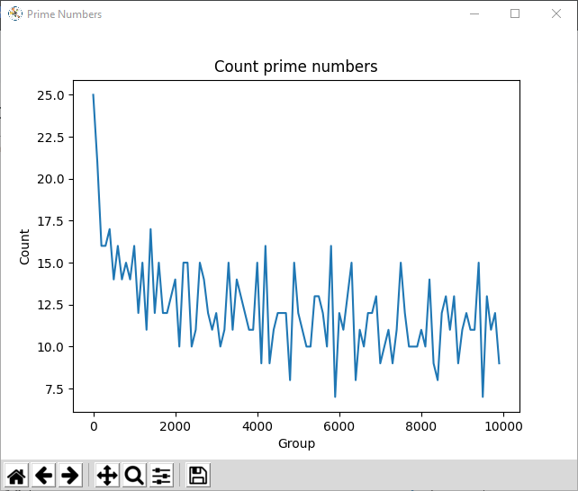
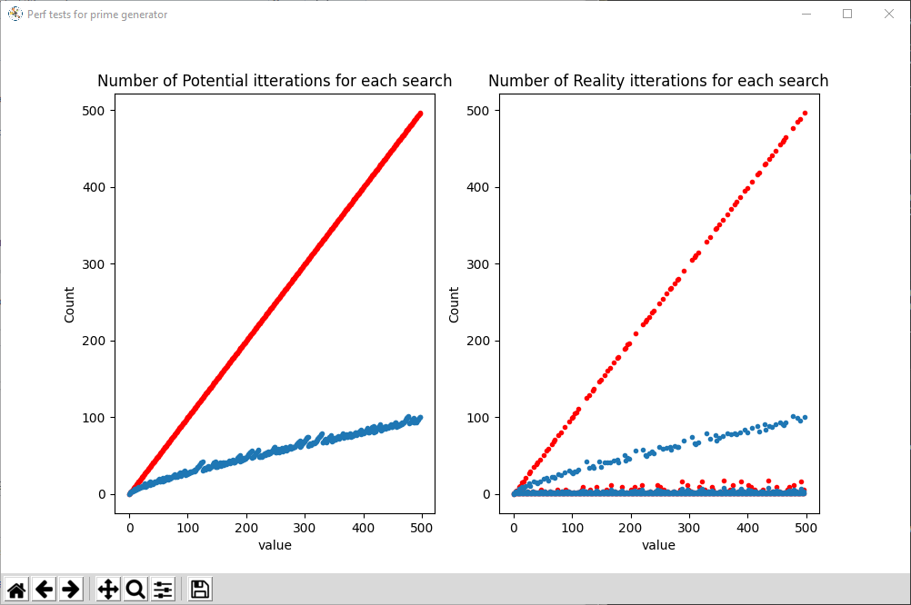

# :abacus: Prime Numbers

## :clipboard: Installation

Use the package manager [pip](https://pip.pypa.io/en/stable/) to install **matplotlib** and **prettytable**.

```bash
pip3 install matplotlib
pip3 install PTable
```

Those libraries help to display tables and curves as shown bellow.


## :rocket: Quick start 

Run this command:
```bash
python main.py
```

## :dart: Results

### :desktop_computer: Consol output
```as
All prime numbers smaller than 100:
 [2, 3, 5, 7, 11, 13, 17, 19, 23, 29, 31, 37, 41, 43, 47, 53, 59, 61, 67, 71, 73, 79, 83, 89, 97]

All primes grouped by 10:
+-------+-------+-------+
| Group | Count | Total |
+-------+-------+-------+
|   0   |   4   |   4   |
|   10  |   4   |   8   |
|   20  |   2   |   10  |
|   30  |   2   |   12  |
|   40  |   3   |   15  |
|   50  |   2   |   17  |
|   60  |   2   |   19  |
|   70  |   3   |   22  |
|   80  |   2   |   24  |
|   90  |   1   |   25  |
+-------+-------+-------+
```

### :chart_with_upwards_trend: Curve plot 


## :gear: Settings
If you want to personalize the output, just change those global variables:

```python
BORNE_SUP = 100
GROUP = 10
```

with `BORNE_SUP = 10000` :




---


# :zap: Playing with performances


## :rocket: Quick start 

Run this command:
```bash
python perfs.py
```

## :stopwatch: Searching primes 
Testing 2 research algoriths : 

1. **Version 1**: Looping through all previous **natural numbers** in order to find a potential divider
1. **Version 2**: Looping through all previous **prime numbers** in order to find a potential divider and then through remaining natural numbers.


```as
All Performance Tests for primes smaller than 5000:
+-----------+--------------------+---------------------+--------------------+
| perf_test |        best        |       average       |       worst        |
+-----------+--------------------+---------------------+--------------------+
|     v1    | 0.5525377999874763 |  0.5553954799892381 | 0.5579596000025049 |
|     v2    | 0.1269804000039585 | 0.12904774001799524 | 0.1309395999996923 |
+-----------+--------------------+---------------------+--------------------+
Average : function 'v2' is 430.4% faster than 'v1'.
```

Performances for primes smaller than 500 :




## :floppy_disk: Storing primes
Testing 3 ways to access and store the primes:

1. Not storing them and calculating them for each iterations
1. Storing them in a file after the first iteration and then accessing them
1. Storing them in a database (SQLite3) after the first iteration and then accessing them


```as
All Performance Tests for primes smaller than 5000:
+--------------------+---------------------+---------------------+--------------------+
|     perf_test      |         best        |       average       |       worst        |
+--------------------+---------------------+---------------------+--------------------+
|    Many to Many    |  12.373290599964093 |  12.441436639986932 | 12.55671519995667  |
| One to Many (file) | 0.36146859999280423 | 0.36461206000531093 | 0.3700205000350252 |
|  One to Many (DB)  |  0.3191932000336237 |  0.3259497000020929 | 0.3340656000073068 |
+--------------------+---------------------+---------------------+--------------------+
```
