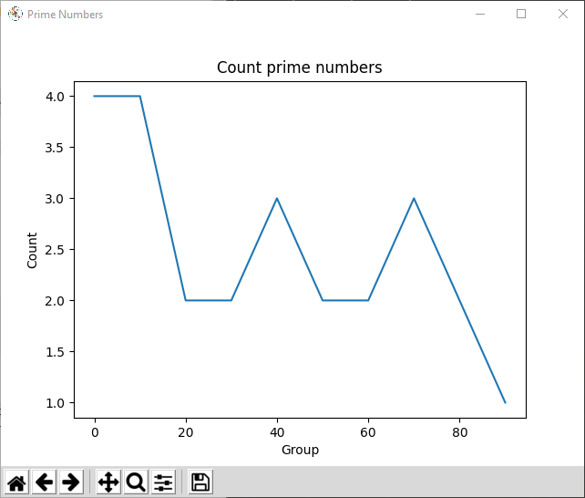

# :abacus: Prime Numbers

## :memo: Installation

Use the package manager [pip](https://pip.pypa.io/en/stable/) to install **matplotlib** and **prettytable**.

```bash
pip3 install matplotlib
pip3 install PTable
```

Those libraries help to display table and curves as shown bellow.


## :rocket: Quick start 

Run this command:
```bash
python math.py
```

## :dart: Result

### :desktop_computer: Consol output
```
All prime numbers less than 100:
 [2, 3, 5, 7, 11, 13, 17, 19, 23, 29, 31, 37, 41, 43, 47, 53, 59, 61, 67, 71, 73, 79, 83, 89, 97]

All primes grouped by 10:
+-------+-------+-------+
| Group | Count | Total |
+-------+-------+-------+
|   0   |   4   |   4   |
|   10  |   4   |   8   |
|   20  |   2   |   10  |
|   30  |   2   |   12  |
|   40  |   3   |   15  |
|   50  |   2   |   17  |
|   60  |   2   |   19  |
|   70  |   3   |   22  |
|   80  |   2   |   24  |
|   90  |   1   |   25  |
+-------+-------+-------+
```

### :chart: Curve plot 



## :gear: Settings
If you want to personalize the output, just change those global variables:

```python
BORNE_SUP = 100
GROUP = 10
```
